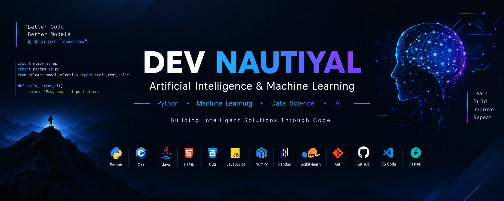

  

<h1 align="center">Hi 👋, I'm Dev Nautiyal</h1>

<h3 align="center">🎓 B.Tech Artificial Intelligence & Machine Learning Student | 🤖 Aspiring AI/ML Engineer</h3>

Passionate about building intelligent solutions using <b>Machine Learning</b>, <b>Artificial Intelligence</b>, and <b>Python</b>. I enjoy solving real-world problems through code and continuously expanding my technical skills.

---

## 🚀 About Me

- 🎓 Pursuing **B.Tech in Artificial Intelligence & Machine Learning**
- 🤖 Passionate about **Machine Learning**, **Artificial Intelligence**, and **Data Science**
- 💻 Strong foundation in **Python**, **C++**, and **Java**
- 🌱 Currently learning **Deep Learning**, **FastAPI**, **LLMs**, and **PostgreSQL**
- 🚀 Building real-world AI and Machine Learning projects
- 🎯 Looking for **AI/ML Internship** opportunities
- 📫 Reach me at **devnautiyal768@gmail.com**

---

## 🌐 Connect With Me

---

# 💻 Tech Stack

### Languages

### Libraries & Frameworks

- NumPy
- Pandas
- Scikit-learn

### Tools

---

# 🌱 Currently Learning

- 🤖 Machine Learning
- 🧠 Deep Learning
- ⚡ FastAPI
- 🔗 LangChain
- 🗄 PostgreSQL
- 🤖 Large Language Models (LLMs)

---

# ⭐ Featured Projects

## 🛡 CyberShield AI

AI-powered cybercrime complaint platform featuring complaint registration, tracking, and intelligent assistance.

**Tech Stack**

`React` • `Python` • `AI`

---

## 📊 IncodeVision Internship

Completed internship tasks including:

- Data Cleaning
- Customer Churn Prediction

**Tech Stack**

Python • Pandas • NumPy • Scikit-learn

---

## 📧 SpamShield Email Filtering System

Machine Learning-based email spam classifier using TF-IDF and Naive Bayes.

**Tech Stack**

Python • Scikit-learn • Streamlit

---

# 📈 GitHub Statistics

---

# 🔥 GitHub Streak

---

# 📈 Contribution Graph

---

# 🏆 GitHub Profile Trophy

---

# 🎯 2026 Goals

- ✅ Strengthen Data Structures & Algorithms
- ✅ Build production-ready AI applications
- ✅ Master Machine Learning & Deep Learning
- ✅ Learn Backend Development with FastAPI
- ✅ Explore LLMs and Generative AI
- ✅ Contribute to Open Source
- ✅ Secure an AI/ML Internship

---

# 💡 Quote

> *"The best way to predict the future is to build it."*

---

<h3 align="center">✨ Thanks for visiting my profile! ✨</h3>

